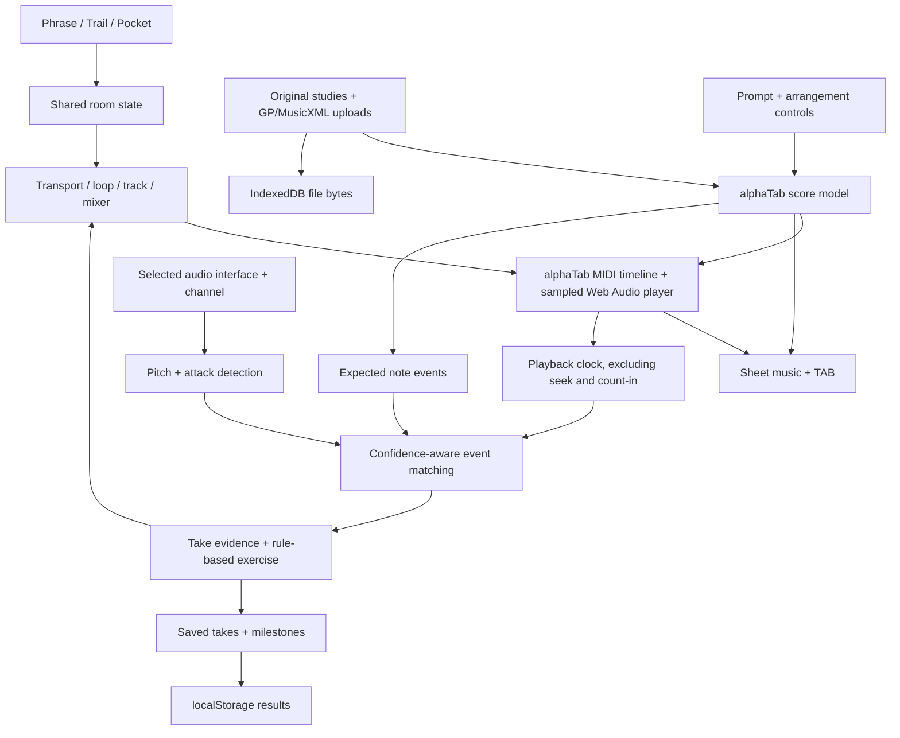

# Practice Room

A fresh guitar-and-bass-first prototype with three practice experiences in one app. The earlier tempo-trainer runtime has been replaced. The design PDFs remain in [spikes/product-design-2026-09-29](spikes/product-design-2026-09-29).

## Run it

Node 22.12 or newer is required.

```sh
npm ci
npm run dev
```

Open http://localhost:5173. No accounts, API keys, backend or external AI service are needed. Fonts and the sampled instrument bank are served locally. Audio input needs localhost or HTTPS.

## A first tour

1. **Phrase** — open an original study or import a Guitar Pro/MusicXML file. Select guitar or bass, score/TAB, a measure range and tempo. Listen, then mute your part with Play along. Space toggles playback outside form fields.
2. **Trail** — use Hear the shape, Work the transition and Bring it together. Activities choose passages, tempos and backing settings. Completion is self-marked for the current session, separate from performance evidence.
3. **Pocket** — rehearse with the band, strip back to a click, then bring the other parts back. Free improvisation is not scored; Check take compares the written part.
4. **Make a jam** — try `shuffle beat ii-V-I in A at 90 BPM`. Review Bm7 → E7 → Amaj7, edit the arrangement, then Bring in the band. The arrangement is saved to the local library.
5. **Instrument & tuner** — grant audio access, choose your audio interface explicitly, and connect. Choose the browser input channel; set hardware gain using the peak meter and clipping indicator. Use the chromatic tuner or lock a guitar/bass string target. Headphones are recommended; live input is never routed to the output.
6. **Feedback** — Explore example feedback works without an instrument connection and is clearly illustrative. For a real take, connect a clean instrument input, use headphones, choose Check take, press record and save the result after review.
7. **Progress** — view actual saved takes with tempo, selected measures, note matches, timing estimates and coverage. Milestones recognize showing up, returning, and matching the same passage twice. Export or clear your history here.

The piece, part, tempo and selected loop are shared across all three designs. Changing an activity deliberately changes those settings. Navigation pauses playback. Large scores scroll inside the notation panel so transport controls remain accessible.

## Implemented

- alphaTab imports Guitar Pro 3–8 and MusicXML, renders standard notation and tablature, and plays sampled guitar, bass, keys and drums through Web Audio.
- Real playback, count-in, metronome, measure loops, speed changes, per-track mute and volume, synchronized cursors, and score/TAB switching.
- Three original generated studies. Jam recipes support major/minor ii–V–I, I–IV–V and 12-bar blues, with shuffle, straight and a simple bossa-style pattern in 4/4.
- Local file persistence in IndexedDB; jam metadata and take results in localStorage. Identical imports deduplicate by content hash.
- Explicit audio-interface selection, browser channel routing, a peak/clipping meter, guitar/bass/chromatic tuning with reference-pitch selection, single-note pitch/onset analysis, confidence-aware take review, rule-based next exercises, and local history.
- Responsive layouts, native modal focus handling, keyboard controls, empty states, corrupt-file feedback, confirmation for destructive local actions, and a recovery screen.

## Prototype boundaries

This is a usable product exploration, not a validated performance assessor. The included SONiVOX SoundFont supplies sample-based General MIDI instruments; premium multisampled libraries and expressive sound design remain future work.

The instrument detector expects clean, isolated single notes. It is not a polyphonic transcriber. Notated chords, percussion and selected expressive techniques are left ungraded; distorted audio or overlapping notes can still confuse it. Timing includes device and browser latency and is explicitly labelled an estimate. Repeated fast attacks, tempo-map changes and complex repeat structures need further alignment work before reliable scoring. Silence yields unclear evidence, not an invented zero score. Interrupted takes consider only the portion reached. A count-in is excluded from the performance window.

Jam prompts use a small deterministic parser, not a language model. The generated music consists of chord-tone patterns and fixed accompaniment templates. It does not yet provide arbitrary forms, custom chord editing, MIDI/audio export or human-level arranging.

Imported embedded recordings are detected but are not synchronized or played. Section ranges start from the first occurrence of each measure. Custom bends and uncommon notation should be compared with the source. Files are limited to 20 MB and 2,000 measures; production imports need worker isolation and stronger compressed-file limits.

There is no cloud sync, recording playback, teacher dashboard, account system, calibrated latency, automated mastery assessment or automatic difficulty promotion. Raw input audio is neither uploaded nor retained. Clearing browser data removes local music and history.

## Shared architecture



`src/music` owns score creation/import and timeline extraction. `src/audio` owns playback, instrument capture, tuning and assessment. `src/app` coordinates shared state. `src/components` contains reusable practice controls. Pages provide library, jam and progress flows. This separation leaves a clear seam for a worker-based detector, richer sample player, persistent service or revised teaching policy without rebuilding three applications.

## Verification

```sh
npm run lint
npm run typecheck
npm run test:coverage
npm run build
npm run preview
```

Tests exercise musical parsing, full-bar arrangements, subdivision timing, generated shuffle notation, low bass through high guitar pitch fixtures, confidence filtering, note matching, import rejection/deduplication and evidence-based milestones. Controlled-clock hook tests cover count-in boundaries, interrupted takes, restart isolation, explicit saving, interface removal/reconnection and resource cleanup. Coverage reporting focuses on pure timing, music and analysis functions; it is not whole-app coverage. Browser checks and remaining validation gaps are recorded in [spikes/prototype-verification.md](spikes/prototype-verification.md).

Use `npm run format` / `npm run format:check` for Prettier, configured in `package.json`. CI verifies the app; the old automatic S3 deployment has been removed. Nothing is deployed by this work.

## Next increments

1. Validate clean DI guitar and bass against hand-annotated recordings; add loopback/device calibration and deterministic audio-clock alignment tests before trusting timing trends.
2. Move import and analysis into workers; handle repeats, pickups, tempo maps, ties and expressive-technique eligibility in the assessment timeline.
3. Add onset discrimination for repeated notes, signal-quality diagnostics and event-level precision/recall benchmarks. Keep unsupported passages ungraded.
4. Compare the three prototypes with musicians: time to first useful loop, willingness to follow a suggested exercise, and return-to-practice rate. Refine feedback language before adding more rewards.
5. Introduce licensed premium instrument layers, more musical accompaniment/voicings and user-editable forms. Add cloud storage only after local workflows are validated.

## Continuing on another server

Clone or pull `main` from [dbjohnson/practice-room](https://github.com/dbjohnson/practice-room). The application, design PDFs and input/tuner work are in the repository. Use Node 22.12+ on the new server:

```sh
git clone git@github.com:dbjohnson/practice-room.git
cd practice-room
npm ci
npm run dev -- --port 5173 --strictPort
```

Dependencies and generated build/font/soundfont files are regenerated locally. User-supplied Guitar Pro scores are local compatibility fixtures and are not committed; copy those separately if needed.

Audio input still comes from the musician's browser and locally connected interface. Access the remote development server through a localhost SSH port forward or HTTPS so browser audio permissions work. Browser-local imports and progress are not part of the repository; changing browser/origin will not move them. Use the existing progress export before changing origins if those records are needed.

Start the next coding session in the checkout and ask it to read `AGENTS.md`, this README, and `spikes/prototype-verification.md`. Completed work includes the three shared practice concepts, GP/MusicXML import, notation/TAB, sampled playback, loops/tempo/mixer, jams, experimental assessment/local progress, and the Instrument & tuner view. The latest increment removed unused trainer assets, editor settings and generated design previews, and added recording lifecycle regression coverage with fixes for opening/count-in notes, duplicate starts and input removal during initialization. The selected direction is recording reliability; player-event alignment and import races remain next steps. The latest automated checks passed: 71 tests, lint, formatting and type checking/build. Earlier desktop/mobile browser inspection and synthetic stereo input/tuner checks are documented in the verification notes. Physical DI guitar/bass, real interface drivers and Safari/Firefox remain unvalidated.

## Notices

alphaTab: MPL-2.0. Its unmodified library is distributed as a dependency. SONiVOX SoundFont: Apache-2.0. Bravura and the Manrope/Fraunces fonts: SIL OFL. The Vite configuration copies alphaTab's font/soundfont assets and their license files before development or build. Generated copies under `public/font` and `public/soundfont` are ignored by Git. Supplied commercial scores were used for local compatibility checks and are not bundled with the app.
