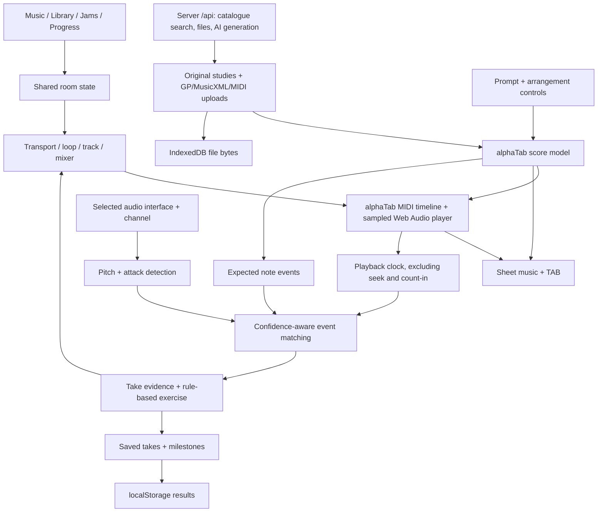

# Practice Room

A guitar-and-bass practice app centered on one full-width music view. The earlier tempo-trainer runtime has been replaced. The design PDFs remain in [spikes/product-design-2026-09-29](spikes/product-design-2026-09-29).

## Run it

Node 22.12 or newer is required.

```sh
npm ci
npm run dev
```

Open http://localhost:5174. Plain local development needs no account, API keys or external AI service. Fonts and the sampled instrument bank are served locally. Audio input needs localhost or HTTPS. The hosted app uses Google sign-in; practice data remains on the browser device.

## Dev workspaces and hosted sign-in

Practice Room adopts Atlas's branch/worktree workflow with a reusable Node/Vite kit. Use `npm run workspace -- new <task-name>` for a new branch and worktree, or `npm run workspace -- start` in an existing feature branch. `status`, `list`, `restart` and `stop` manage those servers. Repo-local skills cover the same lifecycle, rebase and PR preparation.

The configured public origin is **https://practice.loomen.net**. Point Cloudflare at **http://127.0.0.1:8200**, the authenticated gateway. Ordinary Vite uses **5174**, and managed dev servers use **8210–8309**. `npm run build && npm start` serves the protected app. Google client credentials and explicit app/developer allowlists live in ignored `.env`; the callback is `https://practice.loomen.net/auth/google/callback`. The current local setup reuses Atlas's OAuth client with owner-only access. Public service activation is separate from development.

Developers use `/dev/` to choose running builds, with shareable `/dev/use/<id>` links. Both HTTP and HMR WebSockets require developer access through the gateway. Google accounts and dev builds get separate browser-storage namespaces; signing in does not sync or migrate existing practice data.

See [workspace setup, operation and adoption](docs/workspaces.md). `npm run workspace:adopt -- --help` previews or installs the shared kit in another Vite app without copying secrets, music-app code or user data.

### Reuse this process for a new app

The personal `$bootstrap-app` skill packages the setup process and a standalone
copy of the kit. In a future app session, say:

> Use $bootstrap-app to set up this app at https://new-app.loomen.net with the shared dev workspace workflow and Google sign-in.

The skill supplies the repeatable workflow; each app supplies its domain, ports,
access policy and authorized OAuth client. Its installer currently supports
static ESM Vite apps; other frameworks need an adapter. It installs repo-local
workspace/link/rebase/rebuild/wrapup skills for the app's ongoing sessions.

The maintained skill and shared kit live in the private
[dbjohnson/agent-skills](https://github.com/dbjohnson/agent-skills) repository.
Install it on another machine with:

```sh
git clone git@github.com:dbjohnson/agent-skills.git
cd agent-skills
node scripts/link-skill.mjs bootstrap-app
```

The linker registers the checkout in both personal skill locations, preserving
an existing installation when replacement is explicitly requested. Shared fixes
belong in `agent-skills` first. Practice Room keeps its independently runnable
copy; `workspace-kit.json` records the adopted release. Updating the personal
skill does not update or deploy this app. Review and test kit changes here before
adopting a newer release. Credentials and browser data remain local to each app.

## A first tour

1. **Music** — open an original study, import a Guitar Pro, MusicXML or MIDI file, or use **Discover** and **Generate** in the library to search catalogues and have a practice piece written for you. The score fills the available window, with your instrument, notation view, tempo and loop controls always available. Space toggles playback, including after clicking toolbar buttons. Text inputs and dialogs keep their normal keyboard behavior.
2. **Mixer and Effects** — separate panels below the score. Mixer has instrument levels, mute controls and Reset levels; Effects has compression, reverb and swing. **Passages** provides loop shortcuts; **Feedback** provides take setup and example feedback. These panels start collapsed and close when you click outside them or press Escape. **Tuner** opens live tuning, the input meter and input volume (−24 to +12 dB). The header moon/sun button switches between light and dark mode; the choice is saved.
3. **Library and jams** — the far-left navigation menu opens Your library: a searchable table with combined source/key/tag filters, sortable title/source/key/BPM/bar columns and 25/50/100-row pages. Discover, Generate and Import are adjacent sections; successful additions return to the table with an Open in player action. Each piece shows its latest saved version. Every row, including built-in songs, supports inline name/description editing and confirmed removal. Use the pencil to edit, Enter or the checkmark to save, and Escape to cancel. Names and descriptions apply across saved versions; removed built-ins stay removed on reload. Import files by picker or drag-and-drop in the Import section.
4. **Instrument & tuner** — choose your audio interface explicitly and connect. Choose the browser input channel; set hardware gain using the peak meter and clipping indicator. Use the chromatic tuner or lock a guitar/bass string target. Live input is never routed to the output.
5. **Feedback and progress** — connect a clean instrument input, use headphones, press Play to record and save the result after review. Review shows a combined score split evenly between note accuracy and timing, plus both components and signed timing for each note. The progress page shows saved takes and supports export. Example feedback is illustrative and does not change progress.

The URL fragment records the selected song, section, instrument part, notation view, zoom and transposition (for example, `#song=evening-study&section=practice&part=1&view=tab&zoom=100&transpose=3`). Refresh and browser Back/Forward restore that navigation state. Earlier links containing a `concept` parameter still open the same song and view; the obsolete parameter is removed. Links to locally saved imports and jams work where that music is saved; unavailable songs fall back to another library piece, or the empty library when no music remains.

Navigation pauses playback and retains the loaded player. Loops initially cover the entire piece, including after changing songs. Scores use four bars per line at 100% on desktop. Toolbar zoom controls adjust notation from 50–200%; smaller notation fits more bars across the full width, while larger notation fits fewer. Click the percentage to return to 100%. During playback, the score scrolls only when the next line needs to become visible. A thin cursor advances uniformly through each measure, independent of swing; the measure highlight box is hidden. Large scores scroll inside the panel while transport controls remain accessible, including when a secondary panel is expanded. Narrow screens fit fewer bars per line for readability. Notation renders before sample loading starts. Only the active piece’s required notes and velocity layers are downloaded and decoded, with shared requests and a versioned cache across reloads when browser storage is available. The full sample bank is not downloaded.

The score toolbar includes key transposition from −12 to +12 semitones, with a key selector and half-step buttons. It updates notation, key signatures, chord names, playable TAB positions, sampled playback and expected scoring pitches; drums retain their original pitches. Each change starts from the authored score, and selecting another song resets to its original key. Original imports are unchanged. If the original tuning cannot reach a transposed part, standard notation retains the exact pitches instead of inventing fret positions. Saved takes retain their key for review and backing-track replay. The record button is red whenever recording mode is selected, including before recording begins.

## Practice gym

Open **Practice gym** from the navigation menu. The gym shares the existing full-width music workspace, instrument input, recording and feedback.

- **Exercise library:** browse compact tables with search, sortable columns, combined collection/instrument/type/key/favorite filters and 25/50/100-row pages. Routines have their own search (including exercise names), collection/instrument filters and name/BPM/block/set/date sorting. Each library remembers its filters and sorting. Customize a starter or create a scale, arpeggio, literal note sequence, or passage from uploaded/open music. Scale families include all seven major, harmonic-minor and melodic-minor modes, pentatonics, blues and symmetrical scales. Choose guitar/bass, root, ½/1/2/3 octaves, direction, interval/group pattern, rhythm and articulation. Save, edit, duplicate, favorite and remove personal exercises. Built-ins produce personal copies.
- **Transform and sequence:** Transform opens a routine builder. Each ordered block specifies starting/target BPM and step, fixed key/fifths/fourths/chromatic movement, repetitions, rhythm, articulation, rest and optional note/timing score gate. Enable **Routine tempo ladder** and/or **Routine key modulation** under “Repeat the whole routine” to run all blocks before moving to the next key, then repeat that key cycle at each tempo. Enabled routine settings replace the corresponding block settings; other block settings remain active. Key modulation shifts each exercise relative to its written key. Without outer loops, the order stays tempo → key → repetition within each block. The preview and workout bar identify each pass. Routines support reordering, duplicate blocks, copies and deletion; workouts are limited to 240 sets.
- **Practice:** start one exercise or a routine. The compact workout bar sits above the score; press Play to start. With an instrument connected, Play records automatically. Enable **Loop full exercise** before starting to repeat the whole exercise continuously, including while recording. A count-in happens only once. Connected playback shows each completed pass's pitch accuracy, timing score and coverage in the bottom transport bar; review opens only when requested after stopping. Recorded passes are retained individually without restarting the input recorder. Complete, retry, skip, pause and resume sets. Tempo/key/range controls remain available during playback; changing the prescribed settings pauses the workout progression. Reload restores the saved queue in a paused state; Resume restores its exact snapshot.
- **Progress:** every recorded gym attempt automatically retains its score, note/timing metrics and audio when storage permits, including unclear and interrupted attempts. Active play-along and recording time earns XP. Listening, replay, count-in, rests and idle screens earn none. Completed sets, streaks, time milestones, exploration, clean takes and speed records earn badges. Clean-speed records require complete takes with **95%+ notes, 95%+ timing and 90%+ coverage**, comparing the same exercise version, register, key, rhythm and articulation.

Gym definitions, routine state and compact historical results use IndexedDB in the existing account/build namespace. Exercise passages own source snapshots independent of the original import. Recent detailed takes retain the existing 200-take limit; compact gym history is separate. Everything remains on this device; there is no cloud sync or public leaderboard. The URL includes the gym section (`section=gym&gym=routines` or `gym=progress`).

Uploaded exercises copy the selected part’s first voice, pitches and rhythms into 4/4 practice bars, with up to 64 source bars. Guitar effects are simplified; chords play but remain ungraded. Articulation changes affect notation and release/accent playback; scoring measures notes and timing, not picking technique. See the [implementation plan](spikes/practice-gym-plan.md).

All loops, including selected passages and recording, use a cached sampled audio buffer for each track and the Web Audio clock, so scoring and display updates cannot insert a gap at the wrap. The first start prepares the buffer; subsequent starts reuse it until the score, tempo, effects or rhythm changes. Count-in, metronome and score flash are independent icon controls with filled active states. Count-in follows the metronome and flash toggles; a silent visual count-in retains its timing. Metronome volume is adjustable in the mixer during playback and recording and is remembered across reloads. Track levels, mute and solo remain adjustable during playback and recording without restarting the loop. Selecting a part does not mute it; use its Mute button when you want to play it yourself. Solo is temporary. The grouped M/S buttons control mute and solo. Only one track can be soloed at a time; soloing another transfers it. Mute and solo are mutually exclusive on each track: enabling either clears the other. Tempo, swing, key, passage and effects can change during playback; audio is rebuilt when needed and resumes automatically. Timing changes during recording close the current take and start a new one. Restart returns to the passage beginning and continues playing; turning Loop off finishes the current pass. Loops are limited to ten minutes per pass. Feedback initially uses live input estimates and refines recorded passes from their audio; browsers that require a finalized recording container defer audio refinement until Stop. Without a connected input, playback continues without an accuracy estimate.

## Implemented

- alphaTab imports Guitar Pro 3–8 and MusicXML, renders standard notation and tablature, and plays sampled guitar, bass, keys and drums through Web Audio. MIDI files are notated on import (sixteenths and triplets, one voice per part, suggested guitar and bass fingerings).
- **Discover** in the library searches PDMX (77,321 MuseScore uploads indexed on the server), the Mutopia Project and BitMidi, and links to Songsterr; each result shows its source and licence, can be previewed as playable notation before it is added, and added pieces keep that attribution. **Generate** uses OpenRouter (Sonnet 5.5 by default, with a developer model picker) to compose a piece as alphaTex, with specified instrumentation, checked by the notation engine before it opens. **Edit with AI** in the score view revises the current piece through chat and keeps earlier versions locally. Enter submits (Shift+Enter adds a line), and the header version selector opens earlier versions. Accepted generation requests and results persist on the server; reopening the same browser/build recovers completed work into the library. Old failures remain in chat without a repeated notification. See [finding and generating music](docs/sources.md).
- Real playback, count-in, metronome, measure loops, speed changes, per-track mute and volume, synchronized cursors, and score/TAB switching. The high-contrast cursor moves uniformly across each measure, independently of swing; note highlighting still follows the played notes. Playback scrolls vertically only when the active line falls outside the visible score area. The separate Effects panel includes compression, reverb and swing amount sliders; swing ranges from straight eighths through triplets to a heavy shuffle.
- Three original generated studies. Jam recipes support major/minor ii–V–I, I–IV–V and 12-bar blues, with shuffle, straight and a simple bossa-style pattern in 4/4.
- Local file persistence in IndexedDB; jam metadata, take results and practice settings in localStorage. Click, flash, metronome volume, count-in, loop and effect amounts are remembered, as are each piece's tempo, loop range and mix. Identical imports deduplicate by content hash.
- Live note detection in an AudioWorklet, timed from the audio clock. Takes remove a known latency before judging timing: a cable measurement for the connected interface and channel when one exists, otherwise the output and input delay the browser reports. The review names the source and shows average placement and spread.
- A MIDI instrument (keyboard, MIDI guitar, other controller) as an alternative to the audio interface for recorded takes, with chords graded note by note. Percussion parts and drum pads are not graded yet, and MIDI takes record no audio.
- Per-part MIDI output for your own instruments. A browser cannot load VST or AU plugins such as Addictive Keys or Addictive Drums, so open Mixer, choose Use your own instruments and send a part to a MIDI output; its built-in sound is muted. Host the plugin in a DAW or plugin host listening on that port (an ALSA port on Linux, the IAC Driver on macOS, loopMIDI on Windows). Drums default to channel 10, the fader scales velocity, and routes follow the part's name. Notes are timed to land with the built-in band using the browser's reported output latency; keep the host's buffer low. Continuous loops also send routed MIDI parts.
- Explicit audio-interface selection, browser channel routing, a peak/clipping meter, guitar/bass/chromatic tuning with reference-pitch selection, single-note pitch/onset analysis, confidence-aware take review, rule-based next exercises, and local history.
- Responsive layouts, native modal focus handling, keyboard controls, empty states, corrupt-file feedback, confirmation for destructive local actions, and a recovery screen.

## Prototype boundaries

This is a usable product exploration, not a validated performance assessor. Playback uses recorded Kount drums and a woodblock click, velocity-layered Karoryfer guitar/bass, and Salamander grand piano. Generated arrangements add drum variation, bass articulation and piano voice leading while preserving guitar/bass practice timing. Other General MIDI programs retain SONiVOX sounds. See [audio sources, licenses, preparation and limitations](docs/audio-assets.md).

The instrument detector expects clean, isolated single notes. It is not a polyphonic transcriber. Notated chords, percussion and selected expressive techniques are left ungraded; distorted audio or overlapping notes can still confuse it. Timing includes device and browser latency and is explicitly labelled an estimate. Recorded timing uses detected attacks independently of pitch confidence, with separate pitch and timing coverage. A short envelope peak hold prevents ringing strings from creating repeated false attacks. Muted plucks can demonstrate rhythm but do not establish note accuracy or earn clean-take rewards; missing attacks score zero when reliable attacks establish that input was present. Repeated fast attacks, tempo-map changes and complex repeat structures need further alignment work before reliable scoring. Silence yields unclear evidence, not an invented zero score. Interrupted takes consider only the portion reached. A count-in is excluded from the performance window.

Jam prompts use a small deterministic parser, not a language model. The generated music consists of chord-tone patterns and fixed accompaniment templates. It does not yet provide arbitrary forms, custom chord editing, MIDI/audio export or human-level arranging.

PDMX licences are each uploader's own declaration and BitMidi states none; treat both as personal practice material. Songsterr results only link out, as its terms require. MIDI notation is approximate for played-in files, and AI-written pieces have not been evaluated for musical quality. AI generation needs an Anthropic key on the server and is off without one.

Imported embedded recordings are detected but are not synchronized or played. Section ranges start from the first occurrence of each measure. Custom bends and uncommon notation should be compared with the source. Files are limited to 20 MB and 2,000 measures; production imports need worker isolation and stronger compressed-file limits.

With an instrument connected, Play captures the selected input channel and draws a continuous waveform over each line of the score. Review and replay use the backing track by default, with an option to hear the recording alone. Save keeps the WAV audio and timeline in browser IndexedDB; Download audio exports the take. History JSON contains results and metadata, not audio. The selected interface, channel and input gain are remembered; reload reconnects the interface when microphone permission remains granted. Disconnect turns off automatic reconnection.

Input settings show the latency in use and where it came from. Measure your latency plays twelve clicks through the player's own output; with a cable from the interface output to the selected input, the round trip is timed on the audio clock and saved for that interface and channel. Nothing is played by hand, so the figure is the hardware alone and steady rushing or dragging stays visible in the review. Without a measurement the browser's reported output and input delay is used; it is often close for a wired interface and wrong for Bluetooth, and it can drift by several milliseconds while audio runs.

Final take grading analyses recorded PCM attacks and pitch. The recorder runs on its own clock, so its attacks are lined up with the same attacks heard live on the audio clock before the known latency is applied; the latency is applied once.

Timing receives full credit within ±25 ms and falls linearly to zero at ±150 ms. Missed notes receive zero for note accuracy and timing; unclear input is excluded. Below 60% coverage the combined score is withheld. Saved older takes derive these scores from their stored per-note evidence.

There is no cloud sync, teacher dashboard, validated timing assessment or automatic difficulty promotion. Google sign-in controls hosted access; imports, recordings and progress stay on the browser device. Audio is never uploaded. Catalogue searches go through the server to the sources, and a generation request goes through it to Anthropic. Clearing browser data removes local music and history.

## Shared architecture



`src/music` owns score creation/import, MIDI notation and timeline extraction. `src/server` owns the `/api` routes: catalogue providers, the PDMX index and AI generation; the gateway mounts it in production and Vite in development. `src/audio` owns playback, instrument capture, tuning and assessment. `src/app` coordinates shared state. `src/components` contains reusable practice controls. Pages provide library, jam and progress flows. This separation leaves a clear seam for a worker-based detector, richer sample player, persistent service or revised teaching policy without changing the practice interface.

## Verification

```sh
npm run lint
npm run typecheck
npm run test:coverage
npm run build
npm run preview
```

Tests exercise musical parsing, full-bar arrangements, subdivision timing, generated shuffle notation, low bass through high guitar pitch fixtures, confidence filtering, note matching, import rejection/deduplication and evidence-based milestones. Controlled-clock hook tests cover count-in boundaries, interrupted takes, restart isolation, explicit saving, interface removal/reconnection and resource cleanup. Coverage reporting focuses on pure timing, music and analysis functions; it is not whole-app coverage. Browser checks and remaining validation gaps are recorded in [spikes/prototype-verification.md](spikes/prototype-verification.md).

Use `npm run check` for the combined checks, and `npm run format` / `npm run format:check` for Prettier, configured in `package.json`. CI verifies the app; the old automatic S3 deployment has been removed. Deployments are managed separately from CI.

## Next increments

1. Validate clean DI guitar and bass against hand-annotated recordings; run the cable latency measurement on physical interfaces and compare it with the browser's reported figure before trusting timing trends.
2. Move import and analysis into workers; handle repeats, pickups, tempo maps, ties and expressive-technique eligibility in the assessment timeline.
3. Add onset discrimination for repeated notes, signal-quality diagnostics and event-level precision/recall benchmarks. Keep unsupported passages ungraded.
4. Test the practice workflow with musicians: time to first useful loop, willingness to follow a suggested exercise, and return-to-practice rate. Refine feedback language before adding more rewards.
5. Introduce licensed premium instrument layers, more musical accompaniment/voicings and user-editable forms. Add cloud storage only after local workflows are validated.

## Continuing on another server

Clone or pull `main` from [dbjohnson/practice-room](https://github.com/dbjohnson/practice-room). The application, design PDFs and input/tuner work are in the repository. Use Node 22.12+ on the new server:

```sh
git clone git@github.com:dbjohnson/practice-room.git
cd practice-room
npm ci
npm run dev -- --port 5174 --strictPort
```

Dependencies and generated build/font/soundfont files are regenerated locally. User-supplied Guitar Pro scores are local compatibility fixtures and are not committed; copy those separately if needed.

Audio input still comes from the musician's browser and locally connected interface. Access the remote development server through a localhost SSH port forward or HTTPS so browser audio permissions work. Browser-local imports and progress are not part of the repository; changing browser/origin will not move them. Use the existing progress export before changing origins if those records are needed.

Start the next coding session in the checkout and ask it to read `AGENTS.md`, this README, and `spikes/prototype-verification.md`. Completed work includes the single music workspace, GP/MusicXML import, notation/TAB, sampled playback, loops/tempo/mixer, jams, experimental assessment/local progress, and the Instrument & tuner view. Repository cleanup and recording lifecycle fixes cover opening/count-in notes, duplicate starts and input removal during initialization.

The latest increment adds Atlas-style dev worktrees and skills, Google protection for the hosted app, account/build storage namespaces and an adoption command for other Vite apps. Cloudflare must forward to `127.0.0.1:8200`; dev port 8210 bypasses authentication and must remain private. Reuse Atlas's Google client with the Practice Room callback; credentials stay in ignored `.env`. All 103 tests, lint, formatting and type checking/build pass. Synthetic desktop/mobile browser checks cover the account controls, dev build routing, notation and sign-out. A real Google account sign-in remains unverified. The prepared service template is under `deploy/`; see [workspace operations](docs/workspaces.md) before changing hosting.

The source-discovery increment adds the `/api` server routes, catalogue search, MIDI import and AI generation described in [docs/sources.md](docs/sources.md). Generation has only been exercised with a stand-in model client; set `ANTHROPIC_API_KEY` and try it before relying on it.

Return to recording reliability next: player-event alignment and import races remain open. The cable latency measurement and simulated input paths are tested; physical DI guitar/bass, real interface drivers and Safari/Firefox remain unvalidated.

## Notices

alphaTab: MPL-2.0. Its unmodified library is distributed as a dependency. SONiVOX SoundFont: Apache-2.0. Karoryfer bass/guitar recordings: CC0. Salamander Grand Piano by Alexander Holm: CC BY 3.0. Selected Kount recordings retain the owner's sample-pack license. Full audio credits are bundled with the generated bank; see [audio assets](docs/audio-assets.md). Bravura and the Manrope/Fraunces fonts: SIL OFL. The Vite configuration copies alphaTab's font/soundfont assets and their license files before development or build. Generated copies under `public/font` and `public/soundfont` are ignored by Git. Supplied commercial scores were used for local compatibility checks and are not bundled with the app.

Sample and library credits are also available in the app under **Help → Credits & licenses**, including creator links, licenses and sample preparation notes.

Direct local Vite development on `localhost` or loopback skips Google sign-in. Use the Local URL printed by `npm run workspace -- status` on the dev server machine. Hosted development builds still require an approved Google account; developers can switch running builds directly from the navigation menu’s Build dropdown.
